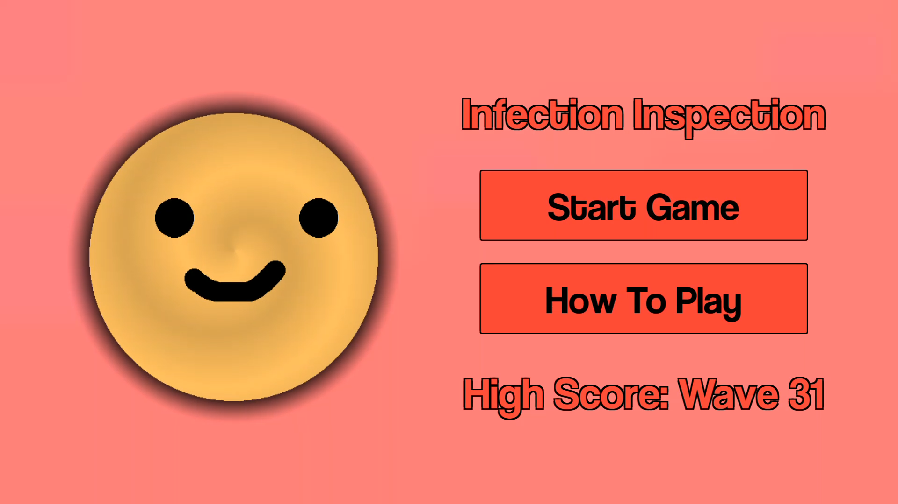
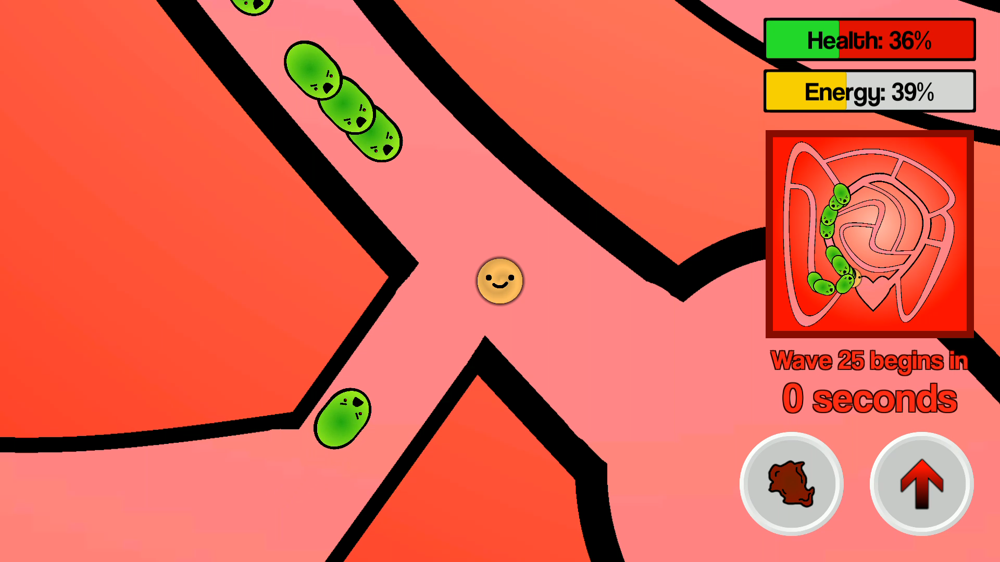
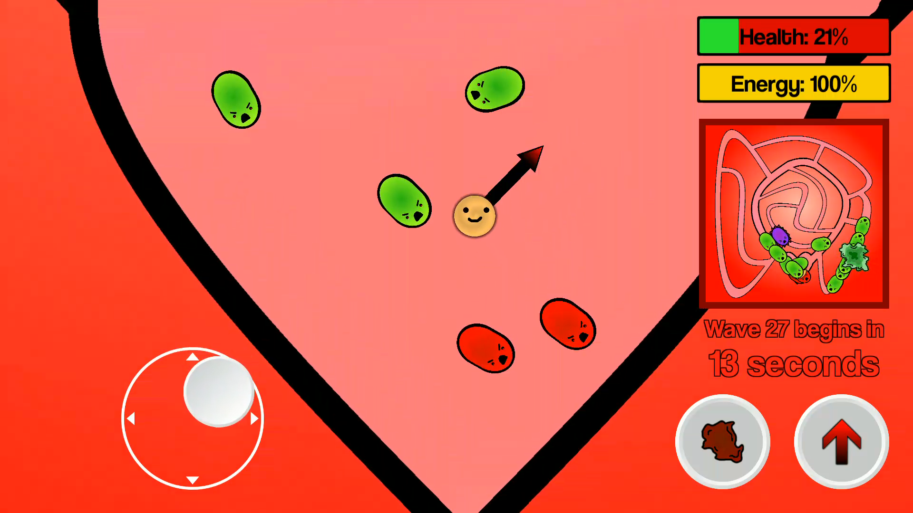
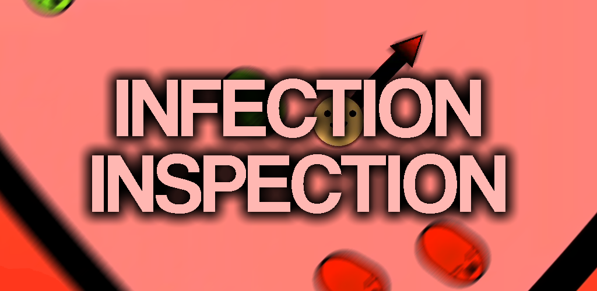

# Infection Inspection
Protect the heart from infection as you defeat wave after wave of bacteria!

## Description from Google Play listing:
Play as Wallace, a lone white blood cell, as you begin your quest to defend the heart from wave after wave of bacteria. You start off easy, with small groups of bacteria attacking from one point at a time, but soon the challenge begins. Engage in dramatic combat with coordinated bacterial attacks as you strive to last as long as possible.

Enjoy smooth camera motion and intuitive, responsive controls to help you on your way to a perfectly healthy body. Whether you choose to play defensive, and guard the heart from the two entrances, or offensive, and chase bacteria down as soon as the wave begins, you can be sure that Infection Inspection provides a fun, unique gaming experience.

A full, custom soundtrack is also included to heighten the drama. Throughout each game, the music becomes discreetly more intense until everything is too much and the body is finally overcome by bacteria. The score is more than fifteen minutes long, so you can be sure that, no matter how good you are, the soundtrack will create an exciting atmosphere for the entire duration of your game.

[Download Infection Inspection now for free!](https://play.google.com/store/apps/details?id=com.CoolTomato.InfectionInspection)

## Less Adverty Description
Infection Inspection is my first Android game. The player (a white blood cell) has to stop bacteria from getting into the heart, otherwise they deal damage. I made Infection Inspection in Unity over a few weeks, and released it to the Play Store in early October 2019.

## Screenshots

